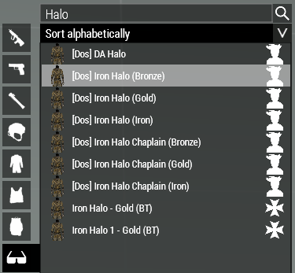
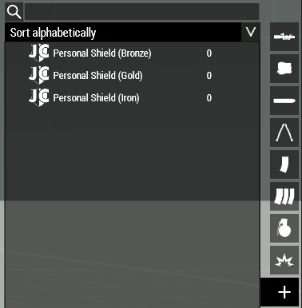
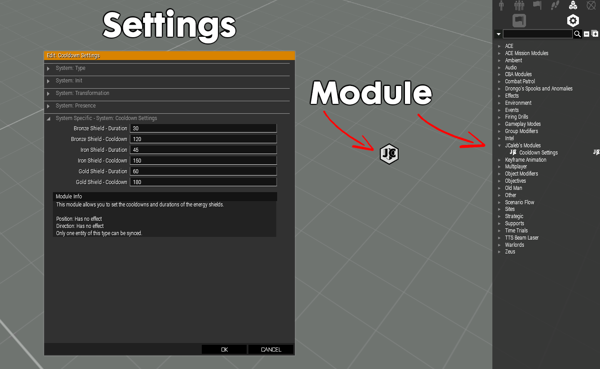
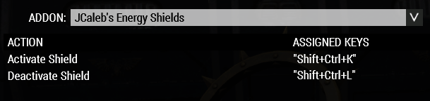

# Mod Page

## What is this mod?

Initially, this adds three different types, or tiers, of shields to emulate the behavior of Space Marine Iron Halos in the 40K Universe. 

Obviously for balance reasons, I created three different types with different kinds of protections.
Bronze Tier: 290 mm RHA Steel;
Iron Tier: 800 mm RHA Steel;
Gold Tier: 10000 mm RHA Steel / Invulnerable (except for scripted damage);

This all sounds excellent, but normally shields from other mods are straight up walls.
These shields work as in lore shields, where:
	- You **can** shoot from **inside TO outside**;
	- You **can't** be shot from **outside TO inside** (unless it penetrates);

## Why such disparity in armor values?

This was balanced versus most weapons a space marine might face when using the popular TIOW(1/2) and AoD mods. 
I compiled my own spreadsheet of different speed, "caliber" and penetration values for most weapons from these mods. (Sheet available here)
Given these values, that seemed to be a good range to not make it that much overpowered for the marines, but still keep it spread out to have a perceived increased in defensiveness.

## OK, I trust you, but how do they work?

You are able to use the shields by two ways:
1. Using a compatible (Iron) Halo from the "facewear" category, as showed in image below
    
2. Having one of these items found in the misc. category on your inventory
    

The system will detect any changes in equipment as soon as you ACE Self Interact/Keybind press and set your duration and cooldown accordingly to your tier. 
If you use both methods at the same time, the highest tier found in the unit will be used.
Examples: 
- Unit has Iron Halo (Bronze) but Personal Shield (Iron) in inventory, shield will be of type Iron;
- Unit has Iron Halo (Gold) but Personal Shield (Bronze) in inventory, shield will be of type Gold;

System logic once you ACE Self Interact:
	Checks:
		1. Checks if the unit has either compatible facewear or items in inventory;
		2. Checks if the unit already has a shield attached to it;
			- If true, stop, "Deactivate Shield" interaction pops up;
			- If false, proceed;
		3. Checks if the unit's cooldown has run out;
			- If true, proceed;
			- If false, stop;
		4. "Activate Shield" Interaction pops up;
	Then:
		1. Initializes shield;
		2. Deletes shield after duration;

## That's really cool, but how do I set different settings?

Glad you asked. The duration (time the shield will be online) and cooldown (time the shield will be offline) can be customized by tiers by using a module.
Settings can be set both on EDEN and while on ZEUS. The newest placed module overrides previous settings.


Input is treated as seconds, tested up to 3 minutes, unknown if it works with higher times (please test and report back :D)



## This is fantastic! Are there any performance caveats?

**Most likely** not. As tested with around 25 players and 55 other mods.
Server-wise, the only script that runs is the propagation of the settings to all clients, which runs only once and is very lightweight as it only sends a few numbers. As long as you don't spam new modules, it should work fine.
All other code is run locally by the client, and I tried to optimize it by writing my code based on ACE3's scripts.

Arma3 scripting is black magic, and I'm only an apprentice wizard after spending two weeks on this, if you find any issues, let me know.

## Models, Retexturing and so on

Models were made by myself after a few days learning LODs and Armor materials, if you want to do something similar, feel free to reach out, and I'll give you a few pointers.

This is straight out-of-the-box compatible with retexturing. You can access the outside (3rd person view) texture and inside (1st person view) textures by these selections
```cpp
hiddenSelections[] = {"Outside", "Inside"};
```

If you want to spawn the shield on a unit and the self interaction / keybind is not working, make sure they have the facewear or item you want the shield to be and run this code by double-clicking that unit
```cpp
_this call jces_shield_fnc_initShield;
```
Alternatively, to delete their shield
```cpp
_this call jces_shield_fnc_delShield;
```

## Compatibility

- [x] [Dosiel Funtime 40k Models](https://steamcommunity.com/sharedfiles/filedetails/?id=2107836294)
- [x] [Black Templars Armoury](https://steamcommunity.com/sharedfiles/filedetails/?id=2452029370)

If your mod adds new iron halo models and you want compatibility, reach out

## Known Issues

- Initial cooldown applies on mission start;
	- Example: Cooldown is set to X seconds. 
	  When the unit spawns, the initial cooldown before it activates the shield for the first time is set to X, instead of being available from the start THEN cooldown being applied.
	- Workarounds: 
		- Have unit spawn, get facewear or item via loadout change/arsenal;
		- Change to a different facewear or item, ACE Self Interact, change back to initial item;
		- Set EDEN module cooldowns to 1 second, once you are ready to start your mission for real, go into ZEUS and place a new module with desired settings;

## Future plans:
- Human sized shields;
  - Soon TM
- Static shields for location defense;
  - 80% done
- Portable shields which a unit can place down, similar to an ACE Deployable (Launcher slot);
  - 95% done :)
- Health values, where hits that don't penetrate still damage the health of the shield itself, which could cause it to "overload" and deactivate prematurely.

## Credits

* Bal & The Ultramarines - Initial idea after initial prototype shield was developed, patience and playtesting.